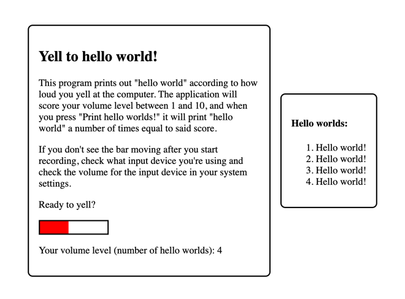

# Yell to Hello World



This submission prints hello world a number of times based on
the volume level of your microphone. It's an incredibly inefficient way
to enter a number, but who doesn't yell at their computer from time to time?

At least this time it'll listen...

## How to Hello World

First, you'll need to install the dependencies.

```bash
npm install
```

Next, spin up the website! Just click the link this command provides in your terminal. Additional
usage information is on the served website.

```bash
npm run dev
```

## Implementation Details

This solution makes use of the [web audio api](https://developer.mozilla.org/en-US/docs/Web/API/Web_Audio_API)
to do real-time processing of your microphone input. The audio API gives us a buffer of measurements from the microphone
as points (samples) on the audio sine wave. Once we get these measurements, we can determine the volume level by saving
the amplitude of the sine wave as a time-windowed maximum of the microphone samples that can be used to determine
a volume level score. We can then manipulate the volume score into a range of 1 to 10 and use that to print "hello world"
a certain number of times.
